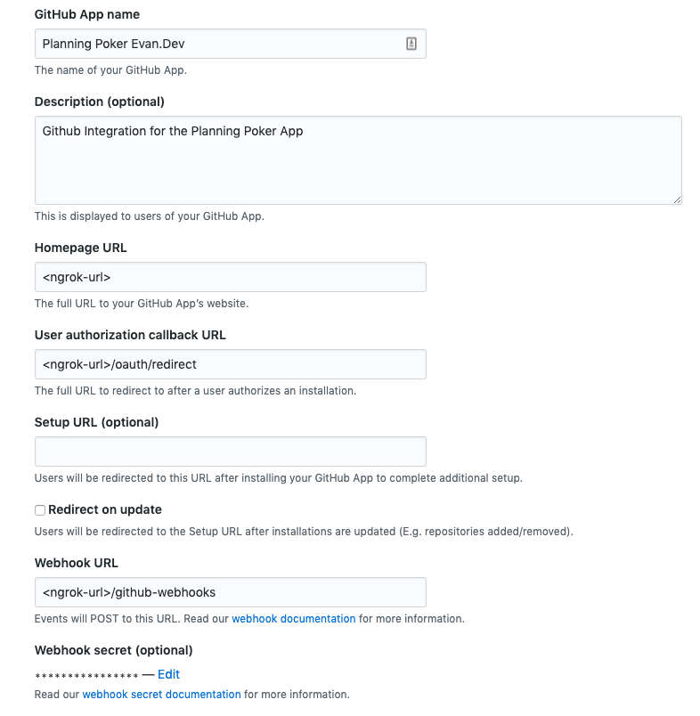

# Planning Poker Backend API

The corresponding frontend for this planning poker api can be found at https://github.com/Ebonsignori/pp-web

This is an MVP that is not robust in its error handling, testing, deployments, and more, but accomplishes the job it set out to do: To provide an api for the planning poker app that integrates with GitHub.

There are poor practices and hacky code in this repo that I'm not proud of, but the functionality is there if anyone ever wants to use it as a base for a more robust product. 

# Dev Setup

1. Start the backend services (Postgres and Redis) with `npm run dev.up`
2. Start server `npm run dev`
3. Start ngrok: `ngrok http 4390`
4. Create a development Github App and populate it, replacing `<ngrok-url>` in the image below with your url
   
      - You can generate `GITHUB_WEBHOOK_SECRET` using [this tutorial](https://developer.github.com/webhooks/securing/).
5. Populate .env with the Github apps information in [.env](./.env), using the current .env as a template.
